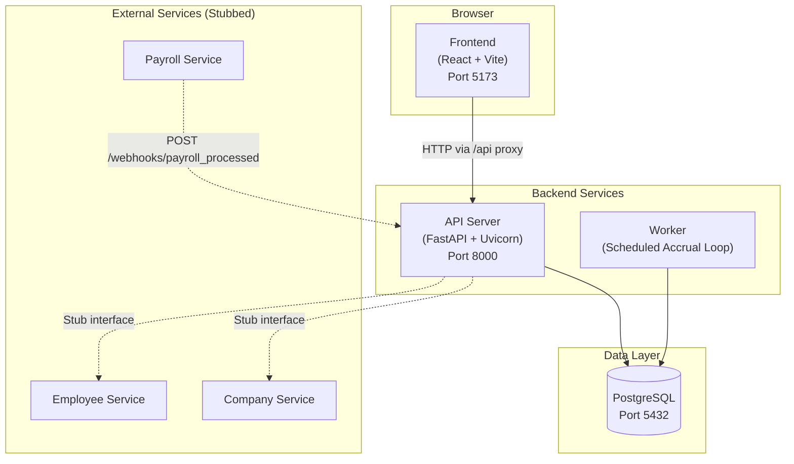
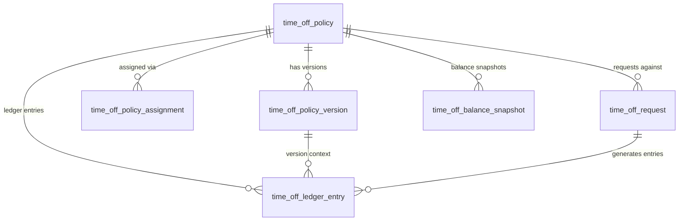
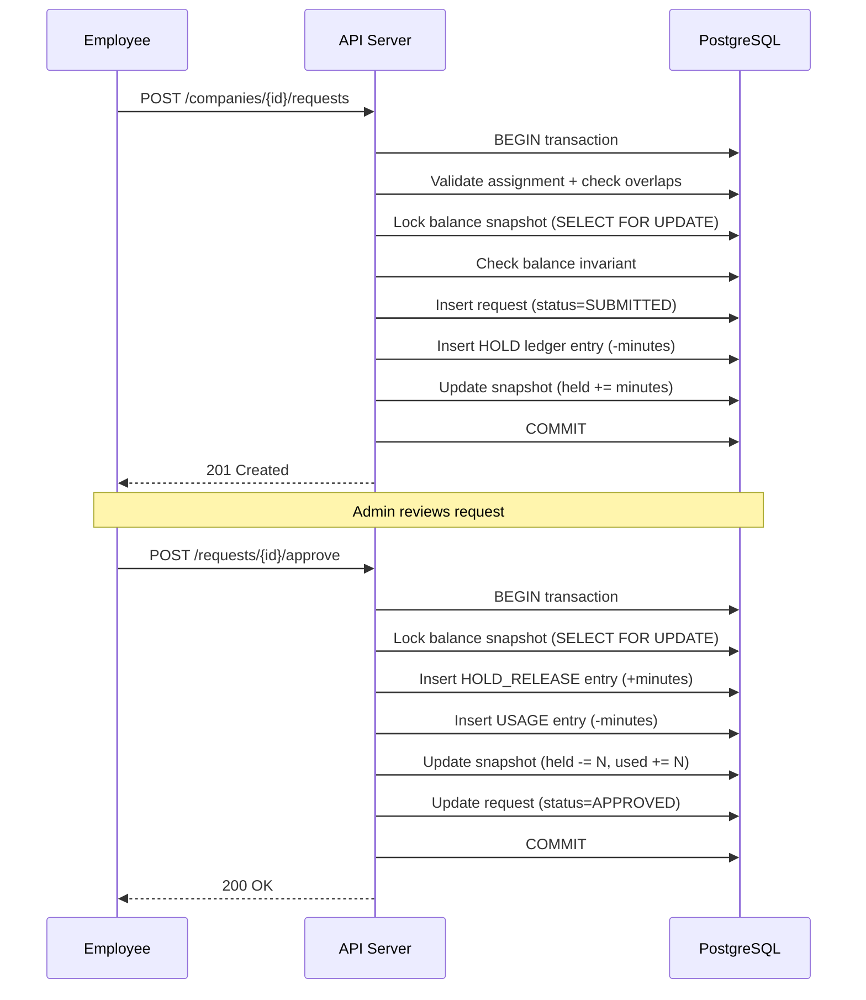
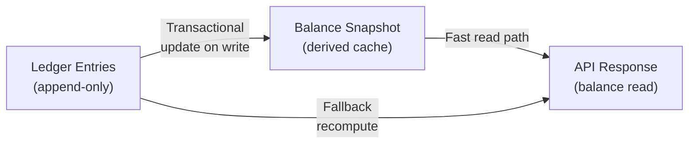
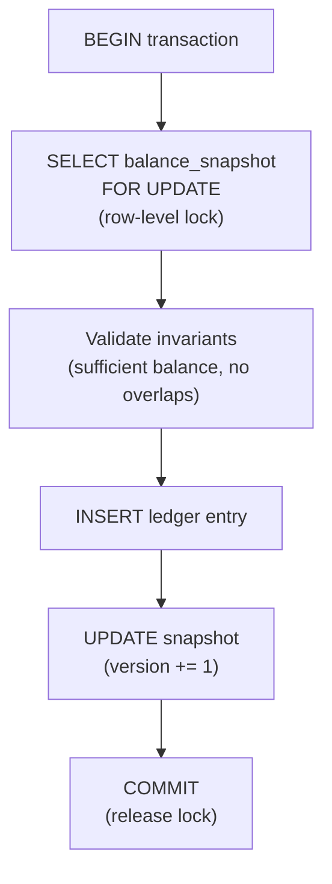
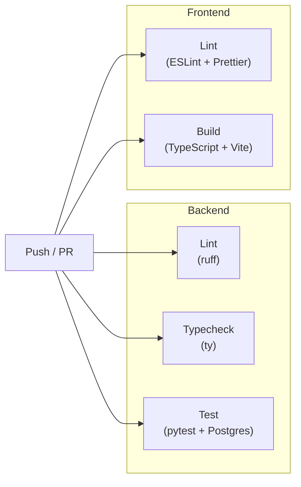

# Architecture

This document describes the system architecture of Power PTO, including component layout, data flows, domain modeling decisions, and concurrency controls.

## Technology Stack

| Layer | Technology | Version |
|-------|-----------|---------|
| API framework | FastAPI | latest |
| Language (backend) | Python | 3.13+ |
| Database | PostgreSQL | 17 |
| ORM | SQLModel (SQLAlchemy 2.0) | latest |
| Migrations | Alembic | latest |
| Validation | Pydantic | 2.x |
| Configuration | pydantic-settings | latest |
| HTTP server | Uvicorn | latest |
| Package manager (backend) | uv | latest |
| Language (frontend) | TypeScript | 5.7+ |
| UI framework | React | 19 |
| Bundler | Vite | 7.x |
| Component library | shadcn/ui (Radix + Tailwind) | latest |
| Data fetching | TanStack Query | 5.x |
| Routing | React Router | 7.x |
| Forms | React Hook Form + Zod | latest |
| Package manager (frontend) | Yarn | latest |
| Containers | Docker + Docker Compose | latest |
| CI | GitHub Actions | N/A |
| Linting (Python) | ruff | latest |
| Type checking (Python) | ty | latest |
| Linting (TS) | ESLint | 9.x |
| Formatting (TS) | Prettier | 3.x |

## System Overview



### Components

**Frontend** — Single-page React application served by Vite's dev server. Communicates with the API via an Axios client that proxies `/api/*` requests to the backend. Uses TanStack Query for server state management and React Router for client-side navigation.

**API Server** — FastAPI application running on Uvicorn with hot reload in development. Handles all REST API requests, enforces business rules, and manages database transactions. Exposes Swagger UI at `/docs` and ReDoc at `/redoc` in non-production environments.

**Worker** — Standalone Python process (`python -m app.worker`) that runs an async loop executing time-based accruals, carryover processing, and balance expiration once every 24 hours. Deployed via the `worker` Docker Compose profile.

**Database** — PostgreSQL 17 with all tables managed by Alembic migrations. Stores policies, assignments, requests, ledger entries, balance snapshots, holidays, and audit logs. All timestamps are stored as `TIMESTAMPTZ` (UTC).

**External Services** — Employee Service, Company Service, and Payroll Service are defined as protocol interfaces with in-memory stub implementations for local development. The Payroll Service communicates via a webhook endpoint.

## Monorepo Structure

```
power-pto/
├── backend/
│   ├── app/
│   │   ├── main.py              # FastAPI app factory + lifespan
│   │   ├── config.py            # Settings (pydantic-settings, env vars)
│   │   ├── db.py                # Async engine, session factory, dependencies
│   │   ├── middleware.py        # CORS configuration
│   │   ├── exceptions.py       # AppError + exception handlers
│   │   ├── worker.py           # Background accrual loop
│   │   ├── models/             # SQLModel table definitions
│   │   ├── schemas/            # Pydantic request/response schemas
│   │   ├── services/           # Business logic layer
│   │   └── api/                # Route handlers + dependencies
│   ├── alembic/                # Database migrations
│   ├── tests/                  # pytest test suite
│   ├── pyproject.toml          # Dependencies + tool configuration
│   └── Dockerfile
├── frontend/
│   ├── src/
│   │   ├── features/           # Domain modules (policies, requests, etc.)
│   │   ├── components/         # Layout + shared + shadcn/ui components
│   │   ├── lib/                # API client, auth context, utilities
│   │   ├── routes.tsx          # Route definitions
│   │   └── main.tsx            # Entry point
│   ├── package.json
│   ├── vite.config.ts
│   └── Dockerfile
├── docs/                       # Documentation
├── docker-compose.yml
├── Makefile
├── .github/workflows/ci.yml
└── .pre-commit-config.yaml
```

## Domain Model

The domain is built around **policies**, **assignments**, **requests**, and a **ledger**. See [Data Model](data-model.md) for the full schema reference including column types, indexes, and constraints.



**Key relationships:**

- A **policy** groups versioned configuration for a time-off category (Vacation, Sick, etc.)
- **Policy versions** are immutable snapshots of a policy's settings; updates create new versions
- **Assignments** link employees to policies with effective date ranges
- **Requests** represent time-off submissions with an approval workflow
- **Ledger entries** record every balance-affecting event, referencing both the policy and the specific version in effect
- **Balance snapshots** are derived caches computed from ledger entries

## Data Flows

### Request Lifecycle



On **deny** or **cancel**, the HOLD is released without creating a USAGE entry, restoring the available balance.

### Accrual Engine

```mermaid
flowchart TB
    subgraph TimeBased["Time-Based Accrual (Worker)"]
        W1["Worker wakes (daily)"]
        W2["Find active TIME assignments"]
        W3["Resolve effective policy version"]
        W4["Compute accrual amount\n(frequency, tenure tier, proration)"]
        W5["Apply bank cap"]
        W6["Post ACCRUAL ledger entry"]
        W1 --> W2 --> W3 --> W4 --> W5 --> W6
    end

    subgraph HoursWorked["Hours-Worked Accrual (Webhook)"]
        H1["Receive payroll event\nPOST /webhooks/payroll_processed"]
        H2["For each employee: find\nHOURS_WORKED assignments"]
        H3["Compute accrual from\nworked_minutes * ratio"]
        H4["Apply bank cap"]
        H5["Post ACCRUAL ledger entry"]
        H1 --> H2 --> H3 --> H4 --> H5
    end

    subgraph YearEnd["Year-End Processing (Worker)"]
        Y1["Run carryover (Jan 1)"]
        Y2["Run expiration\n(calendar date or post-carryover)"]
        Y1 --> Y2
    end
```



Both accrual paths are idempotent: duplicate processing of the same date or payroll run is prevented by the unique constraint on `(source_type, source_id, entry_type)`.

### Balance Computation



**Source of truth:** The ledger (`time_off_ledger_entry`) is append-only and immutable.

**Performance:** Balance snapshots are updated transactionally alongside every ledger write. Reads hit the snapshot for O(1) lookups instead of aggregating the full ledger.

**Fallback:** If a snapshot doesn't exist for a given (company, employee, policy) tuple, the balance is recomputed from ledger entries and a new snapshot is created.

**Formula:**

```
available = accrued - used - held
```

Where:
- `accrued` = sum of ACCRUAL + ADJUSTMENT + CARRYOVER + EXPIRATION entries
- `used` = sum of USAGE entry amounts (absolute value)
- `held` = sum of HOLD amounts minus HOLD_RELEASE amounts

## Concurrency Control

All balance-mutating operations (submit, approve, deny, cancel, accrual, adjustment) follow a strict transactional pattern to prevent double-spend:



1. **Row-level lock** — `SELECT ... FOR UPDATE` on the balance snapshot row prevents concurrent modifications
2. **Invariant check** — If `allow_negative=false`, available balance must remain >= 0 after the operation
3. **Atomic writes** — Ledger insert and snapshot update happen in the same transaction
4. **Optimistic locking** — The snapshot `version` column is incremented on every update
5. **Idempotency** — Unique constraint on `(source_type, source_id, entry_type)` prevents duplicate ledger entries; duplicates are caught via `IntegrityError` inside nested savepoints

## Authentication

### Development Mode (Current)

Authentication uses three HTTP headers extracted on every request:

| Header | Type | Description |
|--------|------|-------------|
| `X-Company-Id` | UUID | Tenant/company identifier |
| `X-User-Id` | UUID | Current user identifier |
| `X-Role` | string | `"admin"` or `"employee"` (default: `"employee"`) |

The `AuthContext` dependency validates these headers and provides them to route handlers. Admin-only endpoints use a `require_admin` dependency that returns 403 for non-admin roles.

### Production Target (Future)

The header-based scheme is designed to be replaced by JWT + RBAC middleware. The `AuthContext` interface remains the same — only the extraction mechanism changes.

## Frontend Architecture

The frontend uses a feature-based module structure where each domain area is self-contained:

```
src/features/
├── policies/       # Policy CRUD, version history
├── assignments/    # Employee-policy assignments
├── balances/       # Balance dashboard, ledger view
├── requests/       # Submit requests, approval queue
├── employees/      # Employee management (admin)
├── holidays/       # Holiday calendar (admin)
└── audit/          # Audit log viewer (admin)
```

Each feature module contains:
- `pages/` — Route-level page components
- `components/` — Feature-specific UI components
- `hooks/` — TanStack Query hooks for data fetching and mutations

### Routing

| Path | Page | Role |
|------|------|------|
| `/balances` | My Balances | Employee |
| `/requests` | My Requests | Employee |
| `/approvals` | Approval Queue | Admin |
| `/policies` | Policy List | Admin |
| `/policies/:id` | Policy Detail | Admin |
| `/employees` | Employee List | Admin |
| `/employees/:id` | Employee Detail | Admin |
| `/holidays` | Holiday Calendar | Admin |
| `/audit-log` | Audit Log | Admin |

### Data Fetching

- **TanStack Query** manages all server state with a 30-second stale time
- **Query key factory** (`lib/query-keys.ts`) provides structured, consistent cache keys
- **Axios client** (`lib/api/client.ts`) handles base URL, auth headers, and error extraction
- **Vite dev server** proxies `/api/*` requests to `http://api:8000` (stripping the `/api` prefix)

## CI/CD Pipeline



All five jobs run in parallel on every push to `main` and every pull request. The backend test job spins up a PostgreSQL 17 service container, runs Alembic migrations, and executes the full pytest suite with coverage reporting.

## Docker Services

| Service | Image | Port | Notes |
|---------|-------|------|-------|
| `db` | `postgres:17` | 5432 | Persistent volume, healthcheck |
| `api` | `./backend` | 8000 | Uvicorn with `--reload` |
| `worker` | `./backend` | — | `profiles: [worker]`, optional |
| `frontend` | `./frontend` | 5173 | Vite dev server with HMR |

The `api` and `worker` services share the same Docker image but run different commands. The worker is behind a Docker Compose profile and must be explicitly started with `docker compose --profile worker up`.

## Related Documentation

- [Product Requirements](prd.md) — Business requirements and user stories
- [Technical Design](tdd.md) — Detailed technical design and API surface
- [Data Model](data-model.md) — Database schema, ER diagram, table definitions
- [API Reference](api.md) — Complete endpoint documentation
- [ADR-0001: Ledger-First Balances](decisions/adr-0001-ledger-vs-derived.md)
- [ADR-0002: Immutable Policy Versioning](decisions/adr-0002-policy-versioning.md)
- [Deployment Plan](deployment.md) — Future AWS deployment target
