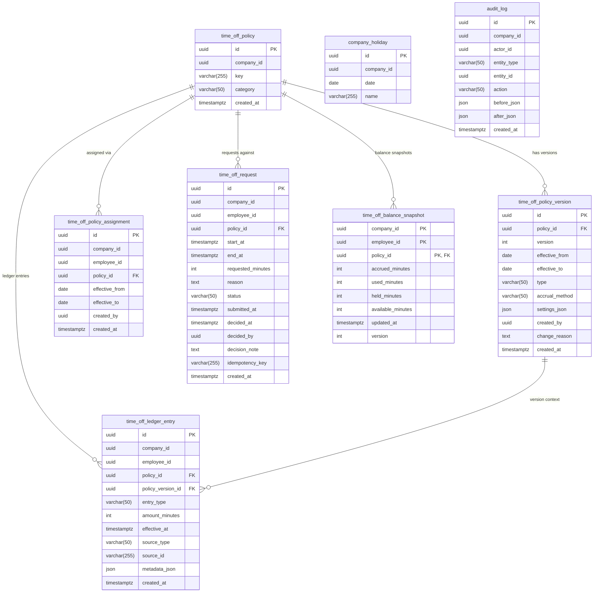
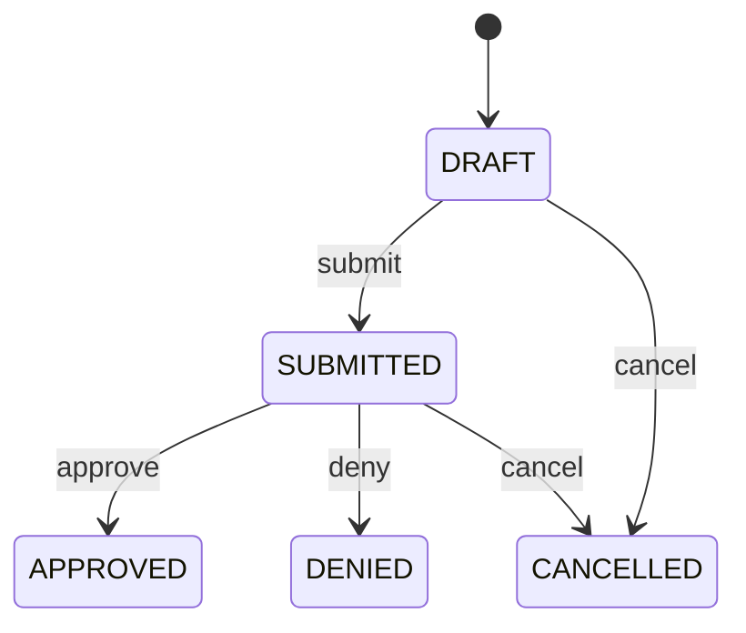
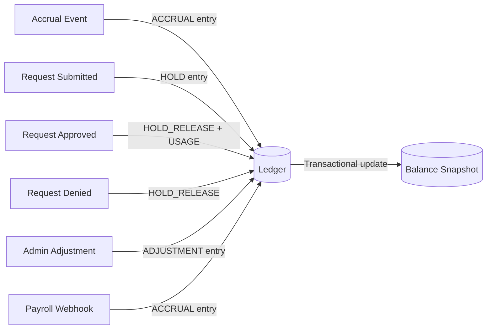

# Data Model

This document describes the database schema for Power PTO. All tables live in a single PostgreSQL database and are managed via Alembic migrations.

## Entity Relationship Diagram

## Request State Machine

- **DRAFT**: Request created but not yet submitted. No balance impact.
- **SUBMITTED**: Request submitted for approval. A HOLD ledger entry reserves the requested minutes.
- **APPROVED**: Request approved. The HOLD is released and a USAGE entry is recorded.
- **DENIED**: Request denied. The HOLD is released (HOLD_RELEASE entry).
- **CANCELLED**: Request cancelled by employee. If a HOLD existed, it is released.

## Ledger & Balance Flow

The **ledger** (`time_off_ledger_entry`) is the source of truth for all balance-affecting events. The **balance snapshot** (`time_off_balance_snapshot`) is a derived cache updated transactionally alongside each ledger write.

**Balance formula:** `available = accrued - used - held`

## Tables

### `time_off_policy`

Logical grouping for a time-off policy (e.g. "Vacation Full-Time"). Policy settings are versioned — this table holds only the stable identity.

| Column | Type | Notes |
|---|---|---|
| `id` | UUID | Primary key |
| `company_id` | UUID | Tenant identifier |
| `key` | VARCHAR(255) | Human-readable slug, unique per company |
| `category` | VARCHAR(50) | One of: VACATION, SICK, PERSONAL, BEREAVEMENT, PARENTAL, OTHER |
| `created_at` | TIMESTAMPTZ | Auto-set on insert |

**Indexes:** `company_id`
**Constraints:** UNIQUE(`company_id`, `key`)

### `time_off_policy_version`

Immutable snapshot of a policy's configuration. Every policy update creates a new version.

| Column | Type | Notes |
|---|---|---|
| `id` | UUID | Primary key |
| `policy_id` | UUID | FK → `time_off_policy.id` (CASCADE) |
| `version` | INT | Monotonically increasing per policy |
| `effective_from` | DATE | When this version takes effect |
| `effective_to` | DATE | Nullable; when superseded |
| `type` | VARCHAR(50) | UNLIMITED or ACCRUAL |
| `accrual_method` | VARCHAR(50) | Nullable; TIME or HOURS_WORKED |
| `settings_json` | JSON | Accrual rate, cap, carryover rules, etc. |
| `created_by` | UUID | User who created this version |
| `change_reason` | TEXT | Optional explanation for the change |
| `created_at` | TIMESTAMPTZ | Auto-set on insert |

**Indexes:** `policy_id`
**Constraints:** UNIQUE(`policy_id`, `version`)

### `time_off_policy_assignment`

Links an employee to a policy with effective dating.

| Column | Type | Notes |
|---|---|---|
| `id` | UUID | Primary key |
| `company_id` | UUID | Tenant identifier |
| `employee_id` | UUID | Employee being assigned |
| `policy_id` | UUID | FK → `time_off_policy.id` (CASCADE) |
| `effective_from` | DATE | Start of assignment |
| `effective_to` | DATE | Nullable; end of assignment |
| `created_by` | UUID | User who created the assignment |
| `created_at` | TIMESTAMPTZ | Auto-set on insert |

**Indexes:** `company_id`, `employee_id`, `policy_id`
**Constraints:** UNIQUE(`company_id`, `employee_id`, `policy_id`, `effective_from`)

### `time_off_request`

An employee's time-off request with approval workflow state.

| Column | Type | Notes |
|---|---|---|
| `id` | UUID | Primary key |
| `company_id` | UUID | Tenant identifier |
| `employee_id` | UUID | Requesting employee |
| `policy_id` | UUID | FK → `time_off_policy.id` (CASCADE) |
| `start_at` | TIMESTAMPTZ | Request start |
| `end_at` | TIMESTAMPTZ | Request end |
| `requested_minutes` | INT | Duration in minutes |
| `reason` | TEXT | Optional reason |
| `status` | VARCHAR(50) | DRAFT, SUBMITTED, APPROVED, DENIED, CANCELLED |
| `submitted_at` | TIMESTAMPTZ | When submitted |
| `decided_at` | TIMESTAMPTZ | When approved/denied |
| `decided_by` | UUID | Approver/denier |
| `decision_note` | TEXT | Optional note from decider |
| `idempotency_key` | VARCHAR(255) | Client-provided dedup key |
| `created_at` | TIMESTAMPTZ | Auto-set on insert |

**Indexes:** `company_id`, `employee_id`, `policy_id`, `status`, (`company_id`, `status`)
**Constraints:** UNIQUE(`company_id`, `employee_id`, `idempotency_key`)

### `time_off_ledger_entry`

Append-only ledger recording every balance-affecting event. This is the source of truth for balances.

| Column | Type | Notes |
|---|---|---|
| `id` | UUID | Primary key |
| `company_id` | UUID | Tenant identifier |
| `employee_id` | UUID | Affected employee |
| `policy_id` | UUID | FK → `time_off_policy.id` (CASCADE) |
| `policy_version_id` | UUID | FK → `time_off_policy_version.id` (CASCADE) |
| `entry_type` | VARCHAR(50) | ACCRUAL, HOLD, HOLD_RELEASE, USAGE, ADJUSTMENT, EXPIRATION, CARRYOVER |
| `amount_minutes` | INT | Signed integer; positive = credit, negative = debit |
| `effective_at` | TIMESTAMPTZ | When the entry takes effect |
| `source_type` | VARCHAR(50) | REQUEST, PAYROLL, ADMIN, SYSTEM |
| `source_id` | VARCHAR(255) | Compound identifier for idempotency |
| `metadata_json` | JSON | Optional additional context |
| `created_at` | TIMESTAMPTZ | Auto-set on insert |

**Indexes:** `company_id`, `employee_id`, `policy_id`, (`employee_id`, `policy_id`)
**Constraints:** UNIQUE(`source_type`, `source_id`, `entry_type`)

### `time_off_balance_snapshot`

Derived balance cache updated transactionally with ledger writes. Uses optimistic locking via `version`.

| Column | Type | Notes |
|---|---|---|
| `company_id` | UUID | Composite PK |
| `employee_id` | UUID | Composite PK |
| `policy_id` | UUID | Composite PK, FK → `time_off_policy.id` (CASCADE) |
| `accrued_minutes` | INT | Total accrued (default 0) |
| `used_minutes` | INT | Total used (default 0) |
| `held_minutes` | INT | Currently held by pending requests (default 0) |
| `available_minutes` | INT | = accrued - used - held (default 0) |
| `updated_at` | TIMESTAMPTZ | Auto-updated on write |
| `version` | INT | Optimistic lock counter (default 1) |

**Primary key:** (`company_id`, `employee_id`, `policy_id`)
**Indexes:** `employee_id`

### `company_holiday`

Company-specific holidays that exclude days from time-off deductions.

| Column | Type | Notes |
|---|---|---|
| `id` | UUID | Primary key |
| `company_id` | UUID | Tenant identifier |
| `date` | DATE | Holiday date |
| `name` | VARCHAR(255) | Holiday name |

**Indexes:** `company_id`
**Constraints:** UNIQUE(`company_id`, `date`)

### `audit_log`

Immutable record of every mutation in the system.

| Column | Type | Notes |
|---|---|---|
| `id` | UUID | Primary key |
| `company_id` | UUID | Tenant identifier |
| `actor_id` | UUID | User who performed the action |
| `entity_type` | VARCHAR(50) | POLICY, POLICY_VERSION, REQUEST, ASSIGNMENT, HOLIDAY, ADJUSTMENT |
| `entity_id` | UUID | ID of the affected entity |
| `action` | VARCHAR(50) | CREATE, UPDATE, DELETE, APPROVE, DENY, CANCEL, SUBMIT |
| `before_json` | JSON | Entity state before mutation |
| `after_json` | JSON | Entity state after mutation |
| `created_at` | TIMESTAMPTZ | Auto-set on insert |

**Indexes:** `company_id`, (`entity_type`, `entity_id`), `created_at`

## Design Decisions

- **VARCHAR over native PG enums** — Avoids `ALTER TYPE ... ADD VALUE` pain in future migrations. Python enums validate at the application layer.
- **Composite PK for balance_snapshot** — Natural key `(company_id, employee_id, policy_id)` enables direct `SELECT ... FOR UPDATE` without a surrogate ID.
- **All durations in integer minutes** — Avoids floating-point drift. 480 minutes = 1 standard work day.
- **Append-only ledger** — Ledger entries are never updated or deleted. Corrections are new entries with opposite signs.
- **`source_id` as VARCHAR(255)** — Supports compound identifiers like `"payroll_run_id:employee_id:policy_id"` for idempotency.
- **JSON columns** — `sa.JSON` maps to JSONB on PostgreSQL automatically.
- **Optimistic locking on balance_snapshot** — The `version` column prevents lost updates during concurrent balance modifications.
