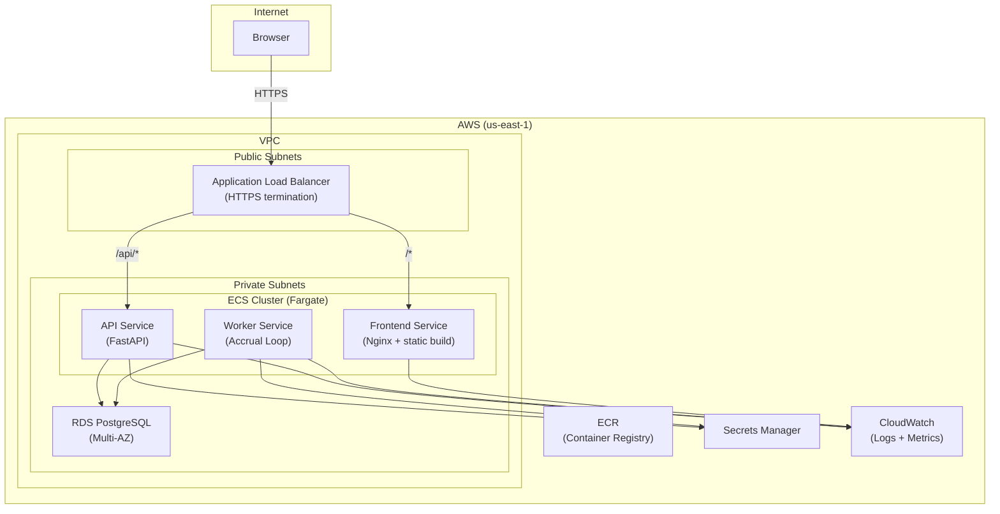

# Future Deployment Plan

This document describes the target production deployment architecture for Power PTO. None of this is implemented yet — it serves as the blueprint for when the system moves beyond local development.

## Target Architecture



### Component Overview

| Component | AWS Service | Notes |
|-----------|------------|-------|
| Load balancer | ALB | HTTPS termination, path-based routing |
| API server | ECS Fargate | FastAPI + Uvicorn, auto-scaling |
| Worker | ECS Fargate | Long-running task, single instance |
| Frontend | ECS Fargate | Nginx serving Vite production build |
| Database | RDS PostgreSQL 17 | Multi-AZ, automated backups |
| Container registry | ECR | One repo per service |
| Secrets | Secrets Manager | DB credentials, JWT signing key |
| Logging | CloudWatch Logs | Structured JSON logs |
| Metrics | CloudWatch Metrics | Request latency, error rates |
| DNS | Route 53 | Custom domain + SSL certificate via ACM |

## Terraform Resource Outline

The infrastructure would be managed with Terraform, organized into modules:

### Networking

```hcl
# VPC with public and private subnets across 2 AZs
module "vpc" {
  # VPC, 2 public subnets, 2 private subnets
  # NAT gateway for private subnet internet access
  # VPC endpoints for ECR, Secrets Manager, CloudWatch
}

# Security groups
resource "aws_security_group" "alb"     { /* 80, 443 from internet */ }
resource "aws_security_group" "api"     { /* 8000 from ALB SG */ }
resource "aws_security_group" "worker"  { /* egress only */ }
resource "aws_security_group" "db"      { /* 5432 from API + Worker SGs */ }
```

### Database

```hcl
resource "aws_db_instance" "main" {
  engine               = "postgres"
  engine_version       = "17"
  instance_class       = "db.t4g.medium"    # Start small, scale as needed
  allocated_storage    = 50
  multi_az             = true
  storage_encrypted    = true
  backup_retention     = 7                   # 7-day automated backups
  deletion_protection  = true

  db_subnet_group_name   = aws_db_subnet_group.private.name
  vpc_security_group_ids = [aws_security_group.db.id]

  # Credentials managed by Secrets Manager
  manage_master_user_password = true
}
```

### Container Registry

```hcl
resource "aws_ecr_repository" "api"      { name = "power-pto/api" }
resource "aws_ecr_repository" "worker"   { name = "power-pto/worker" }
resource "aws_ecr_repository" "frontend" { name = "power-pto/frontend" }
```

### ECS Cluster + Services

```hcl
resource "aws_ecs_cluster" "main" {
  name = "power-pto"

  setting {
    name  = "containerInsights"
    value = "enabled"
  }
}

# API service — path-based routing from ALB (/api/*)
resource "aws_ecs_service" "api" {
  cluster         = aws_ecs_cluster.main.id
  task_definition = aws_ecs_task_definition.api.arn
  desired_count   = 2                        # Minimum 2 for availability
  launch_type     = "FARGATE"

  load_balancer {
    target_group_arn = aws_lb_target_group.api.arn
    container_name   = "api"
    container_port   = 8000
  }
}

# Worker service — no load balancer, single instance
resource "aws_ecs_service" "worker" {
  cluster         = aws_ecs_cluster.main.id
  task_definition = aws_ecs_task_definition.worker.arn
  desired_count   = 1                        # Single instance
  launch_type     = "FARGATE"
}

# Frontend service — path-based routing from ALB (default)
resource "aws_ecs_service" "frontend" {
  cluster         = aws_ecs_cluster.main.id
  task_definition = aws_ecs_task_definition.frontend.arn
  desired_count   = 2
  launch_type     = "FARGATE"

  load_balancer {
    target_group_arn = aws_lb_target_group.frontend.arn
    container_name   = "frontend"
    container_port   = 80
  }
}
```

### Load Balancer

```hcl
resource "aws_lb" "main" {
  name               = "power-pto"
  internal           = false
  load_balancer_type = "application"
  subnets            = module.vpc.public_subnet_ids
  security_groups    = [aws_security_group.alb.id]
}

# HTTPS listener with ACM certificate
resource "aws_lb_listener" "https" {
  load_balancer_arn = aws_lb.main.arn
  port              = 443
  protocol          = "HTTPS"
  ssl_policy        = "ELBSecurityPolicy-TLS13-1-2-2021-06"
  certificate_arn   = aws_acm_certificate.main.arn

  default_action {
    type             = "forward"
    target_group_arn = aws_lb_target_group.frontend.arn
  }
}

# API path rule: /api/* → API target group
resource "aws_lb_listener_rule" "api" {
  listener_arn = aws_lb_listener.https.arn
  priority     = 100

  condition {
    path_pattern { values = ["/api/*"] }
  }

  action {
    type             = "forward"
    target_group_arn = aws_lb_target_group.api.arn
  }
}
```

### Secrets

```hcl
resource "aws_secretsmanager_secret" "db_url" {
  name = "power-pto/database-url"
}

resource "aws_secretsmanager_secret" "jwt_secret" {
  name = "power-pto/jwt-signing-key"
}
```

## CI/CD Deploy Pipeline

Deployment is triggered by merges to `main` via GitHub Actions:


### GitHub Actions Workflow

```yaml
# .github/workflows/deploy.yml (target, not yet implemented)
name: Deploy

on:
  push:
    branches: [main]

jobs:
  deploy:
    runs-on: ubuntu-latest
    permissions:
      id-token: write    # OIDC for AWS auth
      contents: read

    steps:
      - uses: actions/checkout@v4

      # Authenticate to AWS via OIDC (no long-lived credentials)
      - name: Configure AWS credentials
        uses: aws-actions/configure-aws-credentials@v4
        with:
          role-to-assume: arn:aws:iam::ACCOUNT_ID:role/github-actions-deploy
          aws-region: us-east-1

      # Login to ECR
      - name: Login to ECR
        uses: aws-actions/amazon-ecr-login@v2

      # Build and push images
      - name: Build and push API image
        run: |
          docker build -t $ECR_REGISTRY/power-pto/api:$GITHUB_SHA ./backend
          docker push $ECR_REGISTRY/power-pto/api:$GITHUB_SHA

      - name: Build and push Worker image
        run: |
          docker build -t $ECR_REGISTRY/power-pto/worker:$GITHUB_SHA ./backend
          docker push $ECR_REGISTRY/power-pto/worker:$GITHUB_SHA

      - name: Build and push Frontend image
        run: |
          docker build -t $ECR_REGISTRY/power-pto/frontend:$GITHUB_SHA ./frontend
          docker push $ECR_REGISTRY/power-pto/frontend:$GITHUB_SHA

      # Run database migrations
      - name: Run Alembic migrations
        run: |
          # Run migrations via ECS task with migration command
          aws ecs run-task \
            --cluster power-pto \
            --task-definition power-pto-migrate \
            --launch-type FARGATE \
            --network-configuration "..." \
            --overrides '{"containerOverrides": [{"name": "api", "command": ["uv", "run", "alembic", "upgrade", "head"]}]}'

      # Deploy new task definitions
      - name: Update API service
        run: |
          aws ecs update-service \
            --cluster power-pto \
            --service api \
            --force-new-deployment

      - name: Update Worker service
        run: |
          aws ecs update-service \
            --cluster power-pto \
            --service worker \
            --force-new-deployment

      - name: Update Frontend service
        run: |
          aws ecs update-service \
            --cluster power-pto \
            --service frontend \
            --force-new-deployment

      # Wait for stable deployment
      - name: Wait for services stable
        run: |
          aws ecs wait services-stable \
            --cluster power-pto \
            --services api worker frontend
```

### Deployment Order

1. **Build** — Docker images tagged with the commit SHA
2. **Push** — Images pushed to ECR
3. **Migrate** — Alembic migrations run as a one-off ECS task before deploying new code
4. **Deploy** — ECS services updated with new task definitions (rolling deployment, zero downtime)
5. **Verify** — Wait for all services to reach a stable state

### Rollback Strategy

- **Application rollback** — update the ECS service to the previous task definition revision
- **Database rollback** — Alembic `downgrade` for reversible migrations; for irreversible migrations, deploy a forward-fix
- **Image tags** — every image is tagged with the commit SHA, enabling precise rollback to any previous deployment

## Environment Configuration

### Environment Variables

| Variable | Description | Source |
|----------|-------------|--------|
| `DATABASE_URL` | PostgreSQL connection string | Secrets Manager |
| `ENVIRONMENT` | `development`, `staging`, `production` | ECS task definition |
| `APP_VERSION` | Application version | Build-time (commit SHA) |
| `CORS_ORIGINS` | Allowed CORS origins | ECS task definition |
| `JWT_SECRET` | JWT signing key (future) | Secrets Manager |

### Secrets Management

- All secrets stored in AWS Secrets Manager
- ECS tasks retrieve secrets at startup via the `secrets` block in task definitions
- No secrets in environment variables, Terraform state, or source code
- Secrets rotated on a schedule (database credentials via RDS managed rotation)

### Configuration by Environment

| Setting | Development | Staging | Production |
|---------|------------|---------|------------|
| Debug | true | false | false |
| Swagger UI | enabled | enabled | disabled |
| CORS | localhost:5173 | staging domain | production domain |
| DB | Local Docker | RDS (single-AZ) | RDS (multi-AZ) |
| Replicas (API) | 1 | 1 | 2+ |
| Replicas (Worker) | 1 | 1 | 1 |
| Log level | DEBUG | INFO | INFO |

## Observability

### Logging

- **Format:** Structured JSON logs for all services
- **Destination:** CloudWatch Logs via awslogs driver in ECS
- **Retention:** 30 days (staging), 90 days (production)
- **Fields:** timestamp, level, service, request_id, company_id, user_id, message, duration_ms

### Metrics

| Metric | Source | Alarm Threshold |
|--------|--------|-----------------|
| Request latency (p50, p95, p99) | ALB target group | p99 > 2s |
| HTTP 5xx rate | ALB | > 1% of requests |
| HTTP 4xx rate | ALB | > 10% of requests |
| Database connections | RDS | > 80% of max |
| CPU utilization | ECS | > 80% sustained |
| Memory utilization | ECS | > 80% sustained |
| Accrual job success/failure | Custom metric (worker) | Any failure |

### Health Checks

- **ALB** — `GET /health` on the API service (5s interval, 3 consecutive failures = unhealthy)
- **ECS** — Container health check on port 8000
- **RDS** — Managed health checks with automatic failover (multi-AZ)

### Alerting

- CloudWatch Alarms for all metrics above thresholds
- SNS topic for notifications (email, Slack integration via Lambda)

## Cost Estimate (Approximate)

| Resource | Spec | Monthly Cost |
|----------|------|-------------|
| RDS (db.t4g.medium, multi-AZ) | 2 vCPU, 4 GB RAM, 50 GB | ~$140 |
| ECS Fargate (API, 2 tasks) | 0.5 vCPU, 1 GB each | ~$30 |
| ECS Fargate (Worker, 1 task) | 0.25 vCPU, 0.5 GB | ~$8 |
| ECS Fargate (Frontend, 2 tasks) | 0.25 vCPU, 0.5 GB each | ~$16 |
| ALB | Base + LCU charges | ~$25 |
| ECR | Storage (~1 GB) | ~$1 |
| CloudWatch | Logs + metrics | ~$10 |
| NAT Gateway | 1 AZ | ~$35 |
| **Total** | | **~$265/mo** |

Costs scale with traffic and data volume. The above assumes low-to-moderate usage (< 1000 requests/minute).

## Security Considerations

- **Network isolation** — API and database in private subnets; only the ALB is internet-facing
- **TLS everywhere** — HTTPS at the ALB; encrypted connections to RDS
- **IAM roles** — ECS tasks use IAM task roles with least-privilege policies
- **No SSH** — Fargate tasks have no SSH access; debugging via ECS exec or CloudWatch logs
- **Dependency scanning** — GitHub Dependabot for automated vulnerability alerts
- **OIDC authentication** — GitHub Actions uses OIDC to assume an AWS IAM role (no long-lived access keys)
